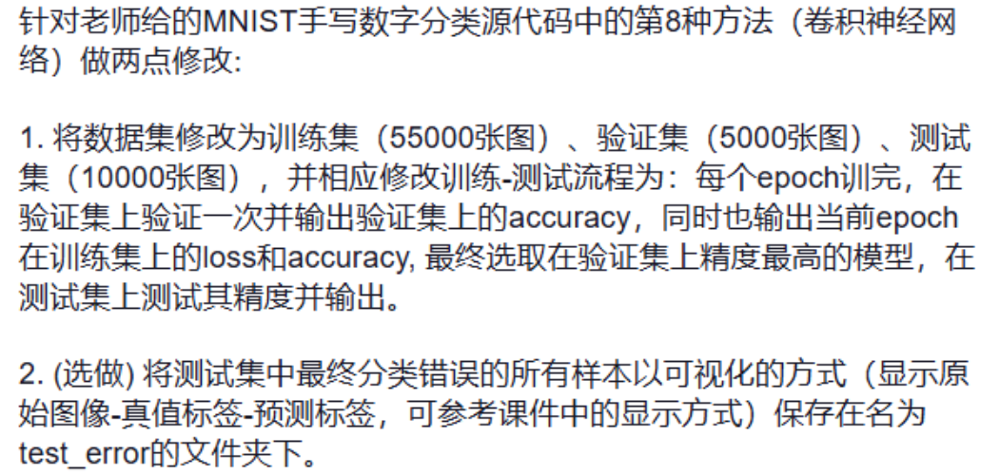

## 这是基于MNIST数据集的手写数字识别任务实验报告

#### 任务要求：

#### 我将任务要求进一步拆分细化，并结合课件中提及的部分内容拓展了实验任务。针对源程序的主要修改点列举如下（标注 ** 号的是拓展部分）：

1. 实现数据集的分割，从训练集中分割出验证集（使用random_split方法）
    
    实现逻辑如下：

        - 手动设置随机种子，确保实验的可重复性

        - 使用random_split从训练集中分割出验证集

2. 数据集处理部分增加数据信息可视化 **

    实现逻辑如下：
        
        针对数据集的可视化
        
        - 使用len函数分别打印训练集、验证集、测试集的样本数量

        - 分别选取三个数据集的第一个样本点，打印图片尺寸和标签
          内容，并使用matplotlib.pyplot模块可视化图片

        针对dataloader的可视化

        - 针对每个dataloader，使用len函数打印包含的批次数，
          并打印某一个批次的图片和标签尺寸

3. 训练-测试流程更改为：每个epoch训完，在验证集上验证一次并输出验证集上的accuracy，同时也输出当前epoch在训练集上的loss和accuracy, 最终选取在验证集上精度最高的模型，在测试集上测试其精度并输出。

    实现逻辑如下：
        
        - 修改训练函数，增加返回平均loss值

        - 修改验证函数，改为先在验证集上前向传播并记录acc，
          后在训练集上前向传播并记录acc，最后函数返回在验证集
          和训练集上的acc

        - 增加测试函数，实现在测试集上完成数据的前向传播并记录acc

        - 在主函数的部分，增加最佳模型参数保存机制，选取在验证集上acc最高的模型进行保存。
          在训练-验证流程结束后，加载已保存的最佳模型参数，完成在测试集上的测试并记录精度

4. 增加gpu训练加速 **

    实现逻辑如下：
        
        - 程序开始阶段使用torch.cuda.is_available()检测gpu是否可用，如果gpu可用，
          则使用完成训练、验证、测试等任务，若gpu不可用，则使用cpu完成任务。

        - 使用对象的to()方法，将代码中的必要部分放在gpu上运行，
          主要是三个部分：实例化后的模型对象、实例化后的损失函数、数据

5. 将测试集上检测错误的样本以可视化的形式单独保存（选做任务）

    实现逻辑如下：
        
        - 增加错误样本可视化函数，输入错误样本和存放路径，用于将错误样本可视化，并存放到指定路径

        - 在测试函数中增加代码段，实现收集错误样本并返回

        - 在主函数中增加代码段：接收测试函数返回的错误样本，并调用错误样本可视化函数，将可视化结果保存到指定路径

#### 运行环境说明

- 本实验在python3.8.20，torch2.2.0 + cuda12.1的windows环境下运行

- 想要成功运行本项目，还需要安装程序开始导入的其它组件

#### 项目文件结构说明

- cnn_mnist.ipynb 文件是代码文件，需要在jupyter notebook环境下运行

- models 是模型参数的存放目录，程序运行前需要保留该空目录，程序不会自动创建该目录

- MNIST 是MNIST数据集存放目录，程序运行后自动创建

- test_error 是错误样本的可视化结果存放目录，程序运行后自动创建

- images 是此.md文件中图片的存放目录

